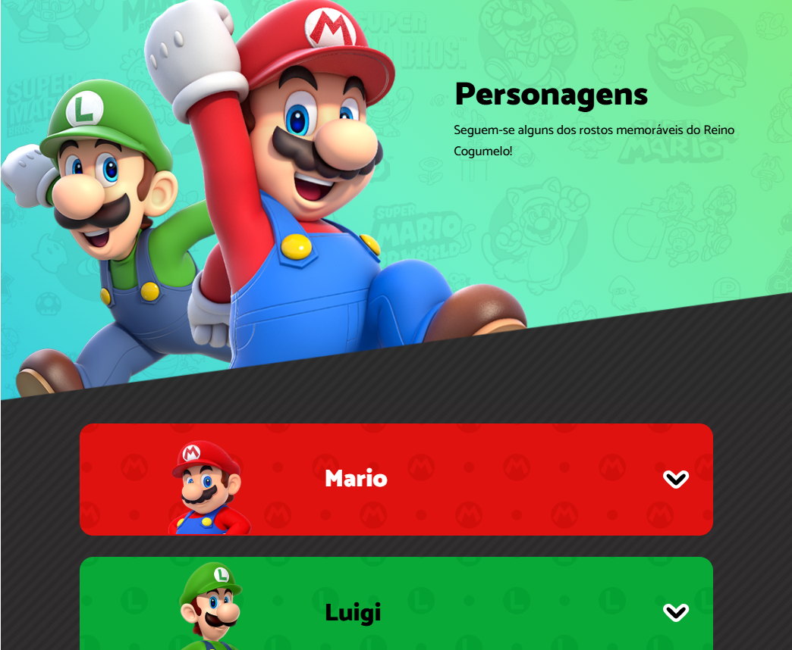

# 🎮 Super Mario Personagens

Bem-vindo ao projeto **Super Mario Personagens**, uma interface divertida e interativa inspirada nos personagens icônicos do universo Mario. Desenvolvido com HTML, CSS e JavaScript puros, o site exibe perfis detalhados de cada personagem da franquia.

---

## 🌐 Acesse o projeto online

🔗 **[Mario Personagens – GitHub Pages](https://amazingbits.github.io/super-mario-personagens/)**  
*(Clique com o botão direito e selecione “abrir em nova guia” caso deseje manter esta aba aberta)*

---

## 🖼️ Preview



---

## 🚀 Tecnologias utilizadas

- HTML5
- CSS3
- JavaScript (Vanilla)
- Animações CSS
- GitHub Pages (para deploy)

---

## 📦 Como rodar localmente

1. Clone o repositório:

   ```bash
   git clone https://github.com/amazingbits/super-mario-personagens.git
   ```

2. Acesse a pasta:

   ```bash
   cd super-mario-personagens
   ```

3. Abra o arquivo `index.html` em seu navegador ou rode um servidor local:

   ```bash
   npx http-server .
   ```

   *(Se você tiver o [http-server](https://www.npmjs.com/package/http-server) instalado globalmente, pode usar diretamente)*

---

## 🧠 Funcionalidades

- Animações suaves ao interagir com os cards.
- Cada personagem exibe imagem, descrição e jogos em destaque.
- Abertura/fechamento com scroll inteligente.
- Somente um card aberto por vez.
- Responsivo e leve.

---

## 🧑‍💻 Autor

Desenvolvido com 💙 por [@amazingbits](https://github.com/amazingbits)

---

## 📄 Licença

Este projeto está sob a licença MIT.  
Sinta-se livre para estudar, modificar e compartilhar!

---
